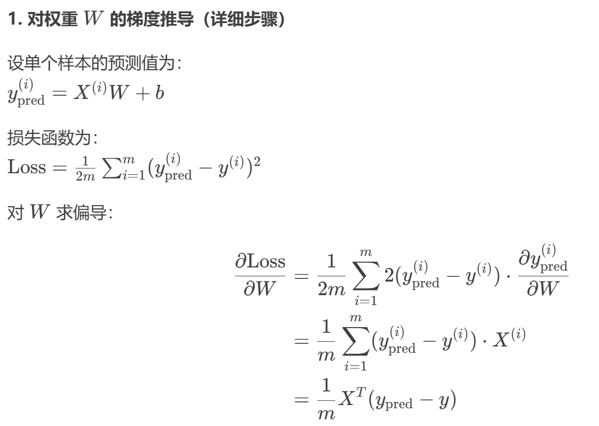
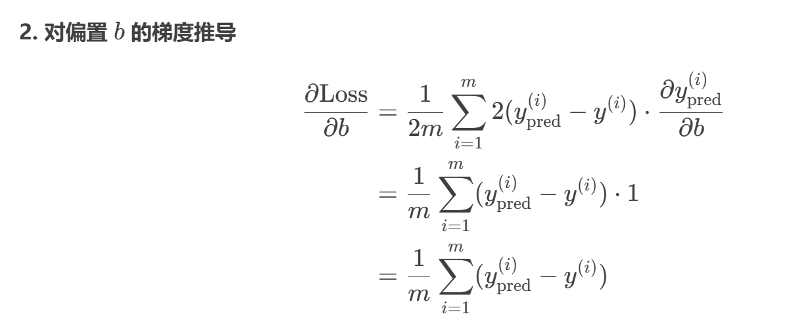

>这是传音控股的一道笔试题目
# 题目
使用Python实现线性回归的训练及推理，包括梯度计算和权重更新的实现
## 我的失误
1. 对线性模型的理解不足：我以为是简单的`y=wx+b`，实际上x是一组属性向量，w也是，它们构成线性组合
2. 损失函数错误：应该使用均方误差，我却只是单纯的作差
3. python实现错误：class后面不需要参数，init函数才有参数，我又弄错的。
4. for x, y in zip(X_test, y_test):这个zip不会写
# 思路
首先，我得回忆一下线性回归的基本原理。线性回归模型应该是y = WX + b，其中W是权重，b是偏置项。训练的目标是最小化预测值和真实值之间的均方误差。

那编程的思路应该是这样的：首先，我需要生成一些模拟数据，或者加载现有的数据。然后初始化参数W和b。接下来，在训练过程中，需要计算前向传播得到预测值，然后计算损失，这里应该是均方误差损失。然后计算梯度，根据损失对W和b的梯度来更新参数。梯度下降的话，可能需要手动计算梯度，而不是用自动求导的库。所以得自己推导梯度公式。

### 编程设计思路

1. **问题理解**：线性回归的目标是找到一条直线（或多维超平面）使得预测值 y=WX+by=WX+b 和真实值的均方误差最小。
    
2. **数据生成**：使用随机数据模拟线性关系，添加噪声以更贴近真实场景。
    
3. **参数初始化**：权重 WW 和偏置 bb 初始化为0或随机值。
    
4. **前向传播**：根据当前参数计算预测值。
    
5. **损失计算**：均方误差（MSE）衡量预测质量。
    
6. **梯度计算**：
    
    - ∂Loss∂W=1mXT(ypred−y)∂W∂Loss​=m1​XT(ypred​−y)
        
    - ∂Loss∂b=1m∑(ypred−y)∂b∂Loss​=m1​∑(ypred​−y)
        
7. **参数更新**：通过梯度下降调整 WW 和 bb。
    
8. **迭代训练**：重复上述步骤直到收敛。
# 代码
```python
import numpy as np

# 生成模拟数据
np.random.seed(42)  # 确保结果可复现
m = 100  # 样本数量
X = 2 * np.random.rand(m, 1)  # 输入特征，范围[0, 2)
y = 3 * X + 5 + np.random.randn(m, 1) * 0.5  # 真实关系：y = 3X + 5 + 噪声

# 参数初始化
W = np.zeros((1, 1))  # 权重矩阵
b = 0.0                # 偏置项
learning_rate = 0.1    # 学习率
epochs = 1000          # 迭代次数

# 训练过程
for epoch in range(epochs):
    # 前向传播：计算预测值
    y_pred = X @ W + b
    
    # 计算均方误差损失（带1/2系数便于求导简化）
    loss = np.mean((y_pred - y) ** 2) / 2
    
    # 计算梯度
    error = y_pred - y
    dW = (X.T @ error) / m  # X转置与误差矩阵相乘，取平均
    db = np.sum(error) / m   # 误差的总和取平均
    
    # 更新权重和偏置
    W -= learning_rate * dW
    b -= learning_rate * db
    
    # 每100次迭代打印损失
    if epoch % 100 == 0:
        print(f"Epoch {epoch}, Loss: {loss:.4f}")

# 输出训练后的参数
print("\n训练后的参数：")
print(f"W = {W[0][0]:.4f}, b = {b:.4f}")

# 推理示例
X_test = np.array([[0.5], [1.5], [2.0]])  # 测试数据
y_test = X_test @ W + b
w = np.array([[3]])
y_true = X_test @ w + 5
print("\n测试结果：")
for x, y, y_t in zip(X_test, y_test, y_true):
    print(f"X = {x[0]:.2f}, 预测y = {y[0]:.2f}, 真实y = {y_t[0]:.2f}")
```

## 问题
1. 关于numpy的矩阵运算，为什么结果是索引的形式？
2. 代码是如何实现梯度计算和权重更新的？这里计算的梯度是否正确？
## 关于np.array
#### **一、NumPy数组的结构**

NumPy数组（`ndarray`）是Python中用于高效存储和操作多维数据的核心数据结构，其核心特点如下：

1. **多维容器**：
    
    - 可以表示 **标量（0维）**、**向量（1维）**、**矩阵（2维）**、**张量（3维及以上）**。
    - 例如：
```python
        scalar = np.array(5)       # 0维数组（标量）
        vector = np.array([1,2,3]) # 1维数组（向量） 1x3
        vector2 = np.array([[1],[2],[3]]) # 3x1
        matrix = np.array([[1,2], [3,4]])  # 2维数组（矩阵）2x2
        tensor_3d = np.array([[[1],[2]], [[3],[4]]])  # 3维数组 2*2*1
```
        
2. **同质数据类型**：
    
    - 所有元素类型必须一致（如 `int32`、`float64`）。
        
3. **形状（Shape）**：
    
    - 描述数组每个维度的长度，例如 `(3,2)` 表示3行2列的矩阵。
## 关于梯度下降法
梯度的计算和参数更新是基于梯度下降法的，因此要实现我们就必须理解该方法。
以我们熟悉的二次函数为例，$y=(x-1)^2+1$，若是我们在一个点(6,y(6))，如何找到极小点呢？

y对x求梯度，得到$y'=2x-2$，那么在(6,y(6))点的梯度为10，方向指向x轴正方向，也就是说在这个点是增加的，那么自然向反方向，即-x的方向移动就能让函数值减小了；若是在（-2，y(-2)）点，梯度为-6，朝着+x方向函数值减小。

然后是学习率的问题。知道方向后，我们给梯度乘一个系数，然后更新x，就能让x向着极小点的方向移动了。

最后，扩展到多元函数，就是求偏导，道理是一样的。

## 关于求梯度的代码实现
求的是对的，只是换成了矩阵的形式

